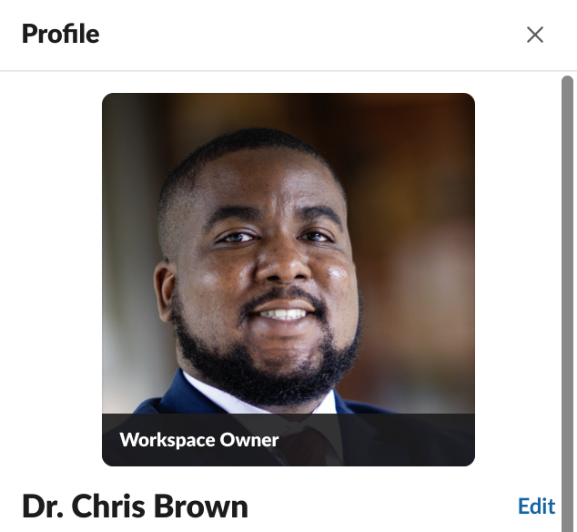

# HW 0

This homework will help you with some setup and preparation for the course.

## Course Overview

**TODO:** Review the [course syllabus](https://docs.google.com/document/d/1SJiwq_c-3qcAkEq5EtIzFng8pZ8S5F1wbr91LzZaW40/edit?usp=sharing).

- [ ] Based on the syllabus and first lecture, fill out this [syllabus survey](https://forms.gle/jfF2e3NZtTnD13v67) with any questions, confusions, or concerns you still have about the course this semester.

## Slack

The primary mode of communication for the course this semester will be Slack. Communication is essential in software engineering and the majority of development teams use some form of IM or messaging system. Slack is one example of these types of platforms, and we will use Slack to provide course updates, answer questions, form project groups, and other course activities. You may download the free version of the Slack desktop application at [https://slack.com/downloads/](https://slack.com/downloads/) or use it online from your preferred web browser. To sign up for the Slack workspace for this course, visit the invite link [here](https://join.slack.com/t/cs5704spring2023/shared_invite/zt-1n2rwbvn4-JS0Krhl1cHQvvOb6Ist~Cg). If you have problems or are unable to join via the link, contact the instructor.

### Profile

**TODO:** Use the following guidelines to create your Slack profile to help the teaching staff and fellow classmates learn your name:
- [ ] Set your full name to be your first and last name. Your display name should be your first name (or name you prefer to go by).
- [ ] Upload a recent photo of yourself (professional headshot or one that meets [passport photo guidelines](https://travel.state.gov/content/travel/en/passports.html/pptphotoreq/photocomptemplate/photocomptemplate_5297.html)) for your profile photo.

Good example ✅: 
Bad example ❌: 

### Introductions

**TODO:** To further help us all get to know each other, please introduce yourself. After your profile has been created, write a brief paragraph in the #general channel of the CS5704 [Spring 2022] Slack that contains the following information:
- [ ] Name
- [ ] Where are you from?
- [ ] Do you have any previous software engineering experience? If so, where did you work and for how long?
- [ ] What do you hope to get out of this course?

## Version Control

[Git](https://git-scm.com/) is the version control system we will be using for this course. You may download the git client to your system [here](https://git-scm.com/downloads). Additionally, [GitHub](https://github.com/) and [GitLab](https://about.gitlab.com/) are two popular cloud-based hosting services for Git. You may use either of these platforms for collaborating on your team project.

**TODO: For this class, you will need access to GitHub.** 

- [ ] If you do not have one already, create a GitHub account at [https://github.com/](https://github.com/).

## SE Basics Workshop

**TODO:** If you do not complete the Software Engineering Basics [workshop](https://docable.cloud/CS5704-VT/Workshops/Basics/README.md) in class on Thursday, finish it as part of HW0. 

- [ ] Submit your completed workshop materials to the [Canvas assignment](https://canvas.vt.edu/courses/145256/assignments/1384316).

**Due:** Friday (1/20) at 11:59pm
